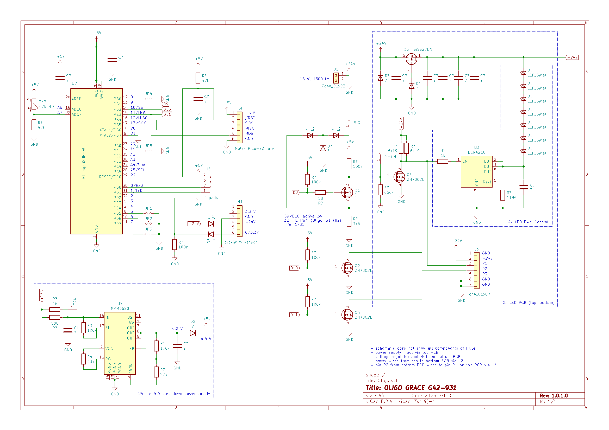
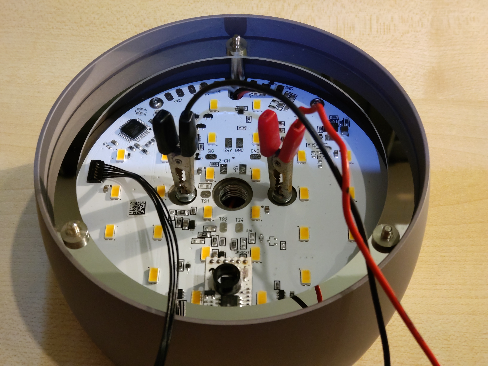

# Oligo Grace Pendant Custom Firmware (model G42-931)

### Table of contents

[1. Motivation](#motivation)  
[2. Hacking the Oligo Grace Pendant](#hacking-the-oligo-grace-pendant)  
[3. Building and Uploading the Custom Firmware](#building-and-uploading-the-custom-firmware)  
[4. Contributing](#contributing)  
[5. Licenses and Credits](#licenses-and-credits)

## Motivation

This project started as a consequence of poor product service. After only 3 years of use the brightness settings backup of my Oligo Grace pendant duo stopped working causing the 2 pendants to have different random brightness at power on.

Contacted with a detailed description of the problem Oligo support suggested resetting the device as described in the owners manual. But this kind of reset only applies to a model variant I did not have. After reporting this to Oligo support I was asked to contact my dealer to return the pendant duo for reprogramming. So I asked my dealer for an offer and got the info that reprogramming will cost at least 20 EUR excluding transport and could take more than 6 weeks. I asked for a fixed service price including transport but got no answer.

Having to pay between 50 EUR and, worst case, the price of a new pendant duo is something probably no one will be happy with and waiting around 6 weeks for the repair to be completed may not feasible without a temporary replacement. For classic ceiling lights mounting a replacement light takes only a few minutes but the pendant duo uses a special ceiling case hiding the transformer and replacing this case creates extra work.

## Hacking the Oligo Grace Pendant

At this point I decided to have a closer look at the inside of pendants - maybe they can be fixed without help from the manufacturer. After only a few minutes looking at the PCB I was pretty sure that self-service is possible, because on the PCB was a combination of the reference applications of several popular chips: MPM3620 5V step down converter, ATmega328P MCU and BCR421U LED driver:

The schematic was obtained by taking a resistance meter with 2 needles for contacting the soldered component pins on the PCB. Knowing what to look for helped a lot but it still took around a day to get most of the details. Writing the prototype of a custom firmware with almost identical functionality took another day. Considering the cost of the product design, schematic design, software development, hardware components and assembly I asked myself how much profit manufacturer and dealer get out of each pendant sold.

Technical notes:

- The standby current of a pendant is unnecessarily high with 25 mA. Around 1/3 of
  this alone is caused by the current through FET Q4 on the bottom panel to keep the
  LED driver disabled when switched off via the proximity sensor.
- Oligo uses a PWM frequency of approximately 31 kHz. If you use lower frequencies
  (e.g. around 5 kHz) you will probably be able to "hear" your LEDs.
- The fixed brightness steps are 3.5 %, 16 %, 32 % and 100 %.
- The brightness settings backup failure was probably caused by writing to often to
  the same EEPROM address. The custom firmware uses a delayed backup strategy to 
  avoid writing every user setting change to EEPROM. Manually changing the EEPROM
  address is also possible.
- When turning power off and on very quickly within a second the Oligo firmware shows 
  a tendency to hang (random brightness, no reaction to gestures, power cycle required
  to reset).
- The custom firmware adds a gesture to lock the proximity sensor by a proximity 
  of more than 15 seconds during power up.
- The Oligo firmware is read protected - it is not possible to backup the original
  firmware.
- According to Oligo support the pendants are specified for around 15000-20000 power
  on cycles.

## Building and Uploading the Custom Firmware

This is an Arduino project so building the firmware is rather straightforward. First modify your Arduino IDE boards.txt as described at the top of the INO file. After restarting the Arduino IDE you will be able to select the Oligo board variant of the Arduino Nano.

For uploading the firmware you need the following components:
- ATmega ISP, e.g. Arduino as ISP incl. USB/TTL adapter
- Molex Pico-EZmate connector, e.g. part no. 369200606, to attach ISP to Oligo board

I placed an Arduino Pro Mini 5V on a breadboard, added 2 LEDs to D8 and D9 for monitoring the ISP status, soldered a pin header to one end of the Molex cable, connected the pin header to D10 to D13 and uploaded the Arduino example project "ArduinoISP" after commenting in "#define USE_OLD_STYLE_WIRING". 

Note: Do not connect the 5 V of the ISP to the 5 V of the Oligo board.

When the LED connected to D9 of the ISP is slowly fading in and out, the ISP is ready. If you have reached this point I recommend to disconnect DTR between the USB/TTL converter and the ISP to avoid accidentally flashing the ISP instead of the Oligo ATmega328P.

Next you should test if the wiring between the ISP and the Oligo board is good by reading from the Oligo ATmega328P with avrdude. You need to power up the Oligo Grace pendant with 24 V. The following commands are for Windows. You will probably need to adjust the paths depending on your Arduino installation. Use the Arduino output during the upload of the Arduino ISP firmware as orientation.

C:\Users\Username\AppData\Local\Arduino15\packages\arduino\tools\avrdude\6.3.0-arduino17/bin/avrdude -C C:\Users\Username\AppData\Local\Arduino15\packages\arduino\tools\avrdude\6.3.0-arduino17/etc/avrdude.conf -v -V -p atmega328p -c stk500v1 -P COM3 -b 19200 -D -U signature:r:-:i

This should output the MCU signature confirming you have found a ATmega328 on the Oligo board and the current setting of the fuses. Compare the fuse values with the values documented at the top of the INO file.

> :warning: **WARNING**: If you decide to continue you will void the warranty
  of your Oligo Grace pendant and you risk permanently bricking your luminaire.
  You may only **USE THIS PROJECT AT YOUR OWN RISK**.
  I do not provide any warranty and I will not assume any responsibility for any
  damage you cause yourself or others by using this project.

After a successful upload of the custom firmware you should not notice significant functional differences but it should fix the brightness settings backup.

It is probably not worth to go to such lengths to fix this problem. Using the Oligo repair service is the easiest way for most. This project just gives you another option.

## Contributing

If you want something clarified or improved you may raise an [issue](https://github.com/jnsbyr/arduino-oligograce).

## Licenses and Credits

Copyright (c) 2022 [Jens B.](https://github.com/jnsbyr/arduino-oligograce)

The code was edited with [Visual Studio Code](https://code.visualstudio.com).

The firmware was build using the [Arduino IDE](https://www.arduino.cc/en/software/).

The schematic was created using [KiCad](https://kicad.org/).

The badges in this document are provided by [img.shields.io](https://img.shields.io/).